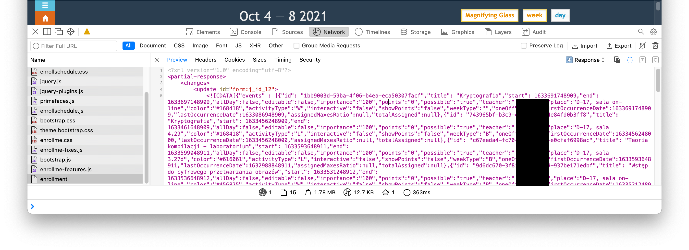

# Enroll to Google Calendar

Tool written to import enroll-me (our faculty's class scheduling system) results into Google Calendar to help one better orginise one's student life.

# Usage

```shell
$ python3 enroll-to-gcal.py --help
usage: enroll-to-gcal.py [-h] [--dest-cal DEST_CAL] [--cred-file CRED_FILE] [--pickle-file PICKLE_FILE] [--source-file SOURCE_FILE] [--term-start TERM_START] [--term-end TERM_END]
                         [--week-type-cal WEEK_TYPE_CAL] [--swap-weeks] [--clean-cal]

Utility to import enroll-me results to Google Calendar

optional arguments:
  -h, --help            show this help message and exit
  --dest-cal DEST_CAL   Google's Calendar destination ID
  --cred-file CRED_FILE
                        Google Keys file
  --pickle-file PICKLE_FILE
                        Google Keys file

Import related arguments:
  --source-file SOURCE_FILE
  --term-start TERM_START
                        University Term start date
  --term-end TERM_END   University Term end date
  --week-type-cal WEEK_TYPE_CAL
                        Calendar ID with week type events
  --swap-weeks          Swap week types

Event cleaner arguements:
  --clean-cal
```

# Step by step

* Obtain credential file from Google Cloud to interact with Google Calendar API [follow this](https://developers.google.com/calendar/api/quickstart/python) and put the file in your working directory with name `credentials.json`
* Install requirements with `pip3 install -r requirements.txt`
* [Create new Google Calendar](https://support.google.com/calendar/answer/37095?hl=en) and obtain its ID from its settings
* Go to enroll and open your schedule results
* Open Developers Console
* Find and download `enrollment.xml` file to your working directory


* Run the tool (**remember to change values!**)
	* If you don't have a calendar with week types, run
		```shell 
		python3 enroll-to-gcal.py --dest-cal abc@group.calendar.google.com --term-start 2021-10-04 --term-end 2022-02-01 --source-file enrollment.xml
		```
	* If you have a calendar with week types, run
		```shell 
		python3 enroll-to-gcal.py --dest-cal abc@group.calendar.google.com --term-start 2021-10-04 --week-type-cal xyz@group.calendar.google.com --source-file enrollment.xml
		```

# Bug reporing
I dont expect any bug repors. This script was written to import schedules for Computer Science students. I believe we all know python, so I expect only pull requests which happily I will review 😇

# License
It's Beerware licensed.